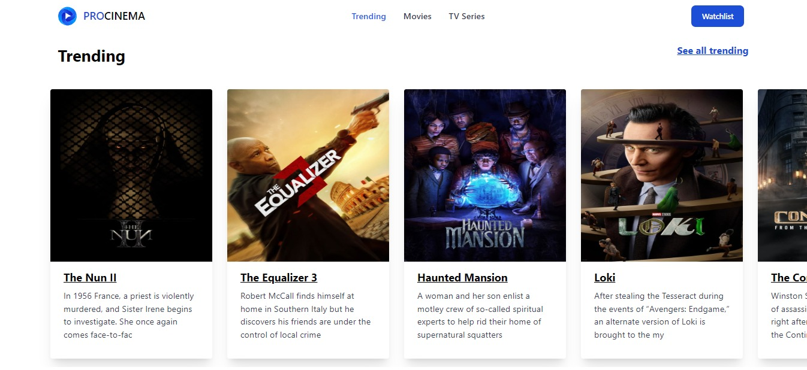

# [Proscene (Website Movie)](https://proscenema.vercel.app/)



## Features

- React.js: A JavaScript library for building user interfaces.
- React Query: A data-fetching and state management library for React applications that simplifies fetching, caching, and updating data.
- Jest: A JavaScript testing framework designed to ensure correctness of any JavaScript codebase.
- Vite: A fast development build tool.
- TypeScript: A typed superset of JavaScript that compiles to plain JavaScript.
- TSX: Syntax extension for embedding HTML-like code within TypeScript.
- ESLint: Linting tool to maintain code quality and consistency.
- Prettier: Code formatter to enforce code style conventions.

## Demo

Check out the [live demo](https://proscenema.vercel.app/) of this project.

## Requirements

Make sure you have the following installed on your machine:

- Node.js (v14.0.0 or above)
- npm (v6.0.0 or above) or yarn (v1.0.0 or above)

## Getting Started

1. Clone this repository:

```bash
git clone https://github.com/fadildr/proscene.git
```

2. Navigate to the project's directory:

```bash
cd proscene
```

3. Install dependencies:

```bash
npm install
#or
yarn start
```

4. Create file `.env` which it contains :

```bash
VITE_REACT_APP_API_KEY=YOUR_API_KEY
VITE_REACT_APP_BASE_URL=https://api.themoviedb.org/3/
```

5. Start the development server:

```bash
npm run dev
#OR
yarn dev
```

5. Open your browser and visit `http://localhost:5173/` to see your React application.

## Available Scripts

In the project directory, you can run the following scripts:
`NPM`

- `npm run dev`: Starts the development server.
- `npm run build`: Builds the application for production.
- `npm run serve`: Serves the production build locally.
- `npm run lint`: Lints the code using `ESLint`.
- `npm run format`: Formats the code using `Prettier`.
- `npm run test`: Run test using `jest`.

`YARN`

- `yarn dev`: Starts the development server.
- `yarn build`: Builds the application for production.
- `yarn serve`: Serves the production build locally.
- `yarn lint`: Lints the code using ESLint.
- `yarn format`: Formats the code using Prettier.
- `yarn test`: Run test using `jest`.

## Project Structure

The project structure follows a conventional React.js setup:

```
country-engine/
  ├── public/                  # Public assets
  ├── src/                     # Application source code
  │   ├── assets/              # Assets for font and image
  │   ├── components/          # Reusable components
  │   ├── pages/               # Application pages
  │   ├── types/               # Interface typescript
  │   ├── hooks/               # Custom Hooks
  │   ├── service/             # API Request
  │   ├── App.tsx              # Main application component
  │   └── main.tsx             # Entry point
  |   └── index.css            # Main CSS
  ├── .eslintrc.js             # ESLint configuration
  ├── babel.config.js          # Babel configuration
  └── package.json             # Project dependencies and scripts
  ├── index.html               # HTML template
  ├── vite.config.ts           # Vite configuration
  ├── tailwind.config.ts       # Tailwind configuration
  ├── tsconfig.json            # Typescript configuration
```

Feel free to modify the structure according to your project requirements.

## Customization

You can customize the configuration by modifying the following files:

- `vite.config.ts`: Vite configuration file.
- `package.json`: Project dependencies and scripts file.
- `tailwind.config.ts`: Tailwind configuration file.
- `babel.config.js`: Babel configuration file.
- `.eslintrc.js`: ESLint configuration file.

## Deployment

To deploy your application, run the following command:

```bash
npm run build
#or
yarn build
```

This will create a production-ready build in the `dist` directory. You can deploy this build to any static file hosting service.

## Contributing

If you find any issues or have suggestions for improvement, feel free to open an issue or submit a pull request. Contributions are always welcome!
